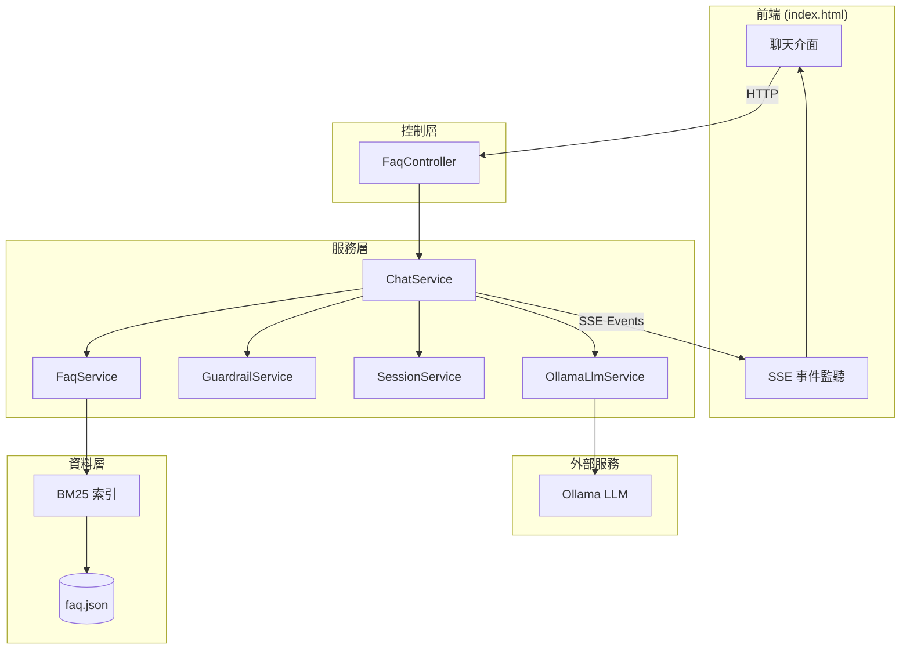
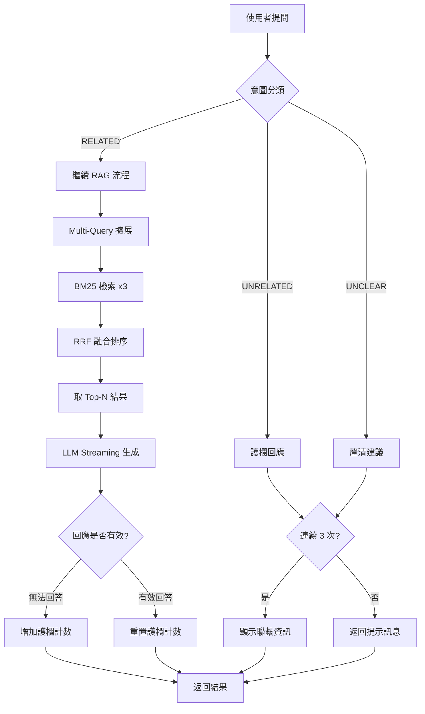
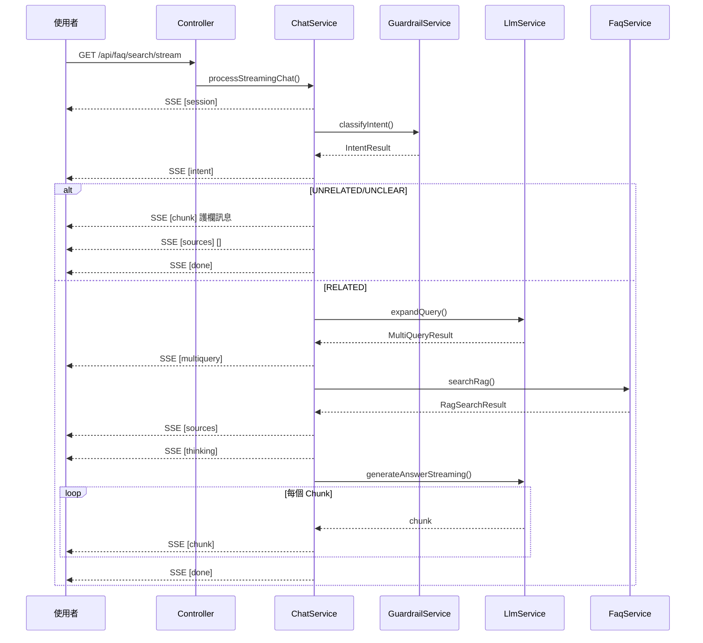
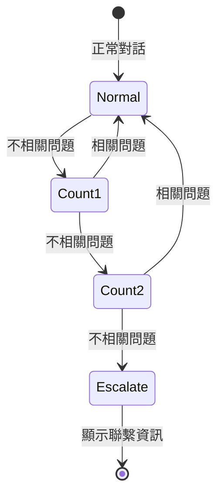

# 銀行 FAQ 智慧問答系統 v3.0

> 封閉領域智慧問答系統 - Multi-Query RAG + Streaming + 安全護欄

## ✨ 功能特色

- 🔍 **Multi-Query RAG**: 查詢擴展 + RRF 融合 + LLM 生成
- 🌊 **Streaming 回應**: SSE 即時串流輸出
- 🛡️ **安全護欄**: 意圖分類 + 升級機制
- 💬 **智慧上下文**: 多輪對話 + 上下文判斷
- ⏹️ **停止生成**: 支援中斷 LLM 回應

---

## 🏗️ 系統架構



---

## � 聊天流程圖



---

## 🔄 SSE 事件流程



---

## 📁 專案結構

```
qa-json-project/
├── src/main/java/com/bank/qa/
│   ├── QaApplication.java
│   ├── controller/
│   │   ├── FaqController.java      # REST API (精簡版)
│   │   └── PageController.java     # 頁面路由
│   ├── service/
│   │   ├── ChatService.java        # 聊天流程介面
│   │   ├── FaqService.java         # FAQ 搜尋介面
│   │   ├── SessionService.java     # Session 管理介面
│   │   ├── GuardrailService.java   # 護欄邏輯介面
│   │   ├── OllamaLlmService.java   # LLM 呼叫介面
│   │   └── impl/
│   │       ├── ChatServiceImpl.java
│   │       ├── FaqServiceImpl.java
│   │       ├── SessionServiceImpl.java
│   │       ├── GuardrailServiceImpl.java
│   │       └── OllamaLlmServiceImpl.java
│   ├── model/
│   │   ├── Faq.java                # FAQ 資料
│   │   ├── ChatSession.java        # 對話狀態
│   │   ├── IntentResult.java       # 意圖分類結果
│   │   ├── MultiQueryResult.java   # 查詢擴展結果
│   │   └── RagSearchResult.java    # RAG 搜尋結果
│   └── util/
│       ├── JsonLoader.java
│       └── VectorUtils.java        # BM25 實作
├── src/main/resources/
│   ├── application.properties
│   ├── faq.json
│   └── templates/index.html
└── src/test/java/
    └── FaqServiceTest.java
```

---

## ⚙️ 配置說明

```properties
# Ollama LLM
ollama.base-url=http://localhost:11434
ollama.model=ministral:8b
ollama.timeout=60000

# Session 管理
session.timeout-minutes=30

# RAG 參數
rag.default-top-n=5
rag.retrieval-top-k=10
rag.rrf-k=60

# 護欄設定
guardrail.escalate-after=3
guardrail.contact-name=李小姐
guardrail.contact-phone=(02)2883-4228 #6633
guardrail.contact-email=lara.li@vteamsystem.com.tw
```

---

## 🚀 快速開始

```bash
# 1. 啟動 Ollama
ollama serve

# 2. 啟動專案
cd qa-json-project
mvn spring-boot:run

# 3. 訪問
open http://localhost:8080
```

---

## 📡 API 端點

| 方法 | 路徑 | 說明 |
|------|------|------|
| GET | `/api/faq/search/stream` | SSE 串流搜尋 |
| GET | `/api/faq/search` | 非串流搜尋 |
| GET | `/api/faq/list` | 取得所有 FAQ |
| POST | `/api/faq/session/clear` | 清除 Session |
| GET | `/api/faq/status` | 系統狀態 |

---

## 🔍 RAG 流程詳解

### 1. Multi-Query 擴展
```
原始查詢: "維持率怎麼算"
    ↓ LLM 擴展
├── original:   "維持率怎麼算"
├── keyword:    "維持率 計算 公式"
└── colloquial: "維持率的計算方式是什麼"
```

### 2. RRF 融合
```
Query 1 排名: [3, 1, 5, 2, ...]
Query 2 排名: [1, 3, 2, 7, ...]
Query 3 排名: [1, 2, 3, 5, ...]
        ↓ RRF 公式
最終排名: [1, 3, 2, 5, ...]
```

### 3. 護欄機制


---

## 🧪 測試

```bash
mvn test
```

---

## 📊 技術堆疊

| 層級 | 技術 |
|------|------|
| 後端 | Spring Boot 3.2.0, Java 17 |
| LLM | Ollama (ministral:8b) |
| 檢索 | BM25 + RRF 融合 |
| 前端 | HTML5 + CSS3 + JavaScript |
| SSE | Server-Sent Events |

---

© 2024 銀行 FAQ 智慧問答系統 v3.0
